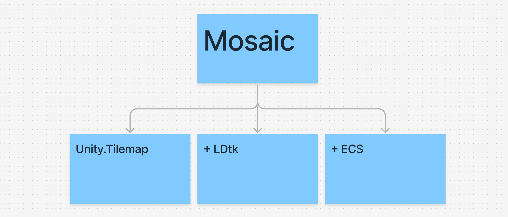
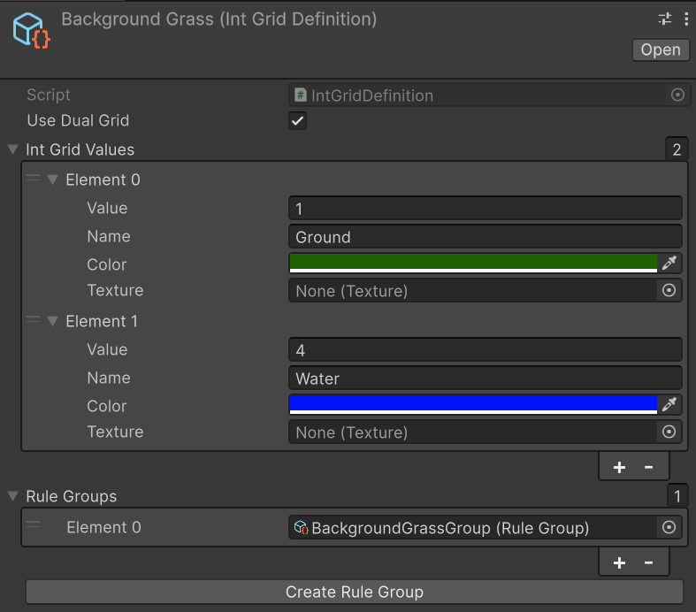

# Mosaic
Mosaic is a Next Gen Runtime Unity Tilemap solution, heavily inspired by LDtk, built using Entity Component System stack and Odin Inspector 




Requires my [KrasCore](https://github.com/Fire-Aalt/KrasCore) library

## Workflow
### Editor
To start we need 2 things: IntGrid and RuleGroup ScriptableObjects

Create IntGrid using "Create/Mosaic/IntGrid". This is how we can configure it:


*You can add a texture to be displayed instead of a color. Use create RuleGroup button to quickly create RuleGroup ScriptableObject*

Open RuleGroup ScriptableObject and add some rules to it like this:

*Every parameter has a tooltip*

To edit the rule pattern, click on the matrix of the rule matrix preview of the rule. This window will pop up:

Here you can modify rule matrix pattern and add or remove results. All of the results are weighted were more weight means more chance to be selected. You can have both sprite and entity to be rendered/spawned.

Next add `GridAuthoring` component to a GameObject in a SubScene and add a `TilemapAuthoring` as a child to Grid. Configure them as needed

### Code
Reference to an `IntGrid` or it's IntGridHash is required to send commands to `TilemapCommandBufferSystem`. 

1. Get a reference to `TilemapCommandBuffer`
```csharp
var em = Unity.Entities.World.DefaultGameObjectInjectionWorld.EntityManager;
var singleton = em.GetSingleton<TilemapCommandBufferSingleton>();
_tcb = singleton.Tcb;

// You can also set global seed here or do it later
_tcb.SetGlobalSeed(seed);
```

2. Use `SetIntGridValue()` to update a referenced `IntGrid`
```csharp
// If you set 0 as IntGridValue you "remove" the position (the same as setting null value using SetTile in Unity.Tilemap)
_tcb.SetIntGridValue(topWalls, new int2(0, 1), topWallsSolidIntGridValue);
```

3. Use `Clear()` to clear all IntGridValues of a specific `IntGrid` or use `ClearAll()` to clear all `IntGrid`s values
```csharp
_tcb.Clear(topWalls);
_tcb.ClearAll();
```

*Done!*

## How do rules work
A matrix represents IntGridValues to search for with an offset from the center of every single position in the world. 
Controls and what they do are as follows:
1. Left click or "solid" color means that this cell must contain this exact IntGridValue
2. Right click or "canceled" color means that this cell can be anything but not this IntGridValue
3. Double right click removes the cell from cells to search (any IntGridValue is valid)
4. Any Value/No Value do the same as any other IntGridValues, but apply as a yes or no filter to the cells IntGridValue (if IntGridValue = 1, and the cell is marked No Value, then the rule will not pass)

## Limitations
Currently only supports Rectangular grids

## Contribution
If you are interested in using this solution I will be greatly appreciated. Write any bugs, feature requests or enhancements to Issues tab

### Special Thanks to:

[LDtk](https://ldtk.io/) for the idea and GUI

[NZCore](https://github.com/enzi/NZCore) for `ParallelList`

[BovineLabs](https://gitlab.com/tertle/com.bovinelabs.core/-/tree/master) for `GetSingleton<>()`
